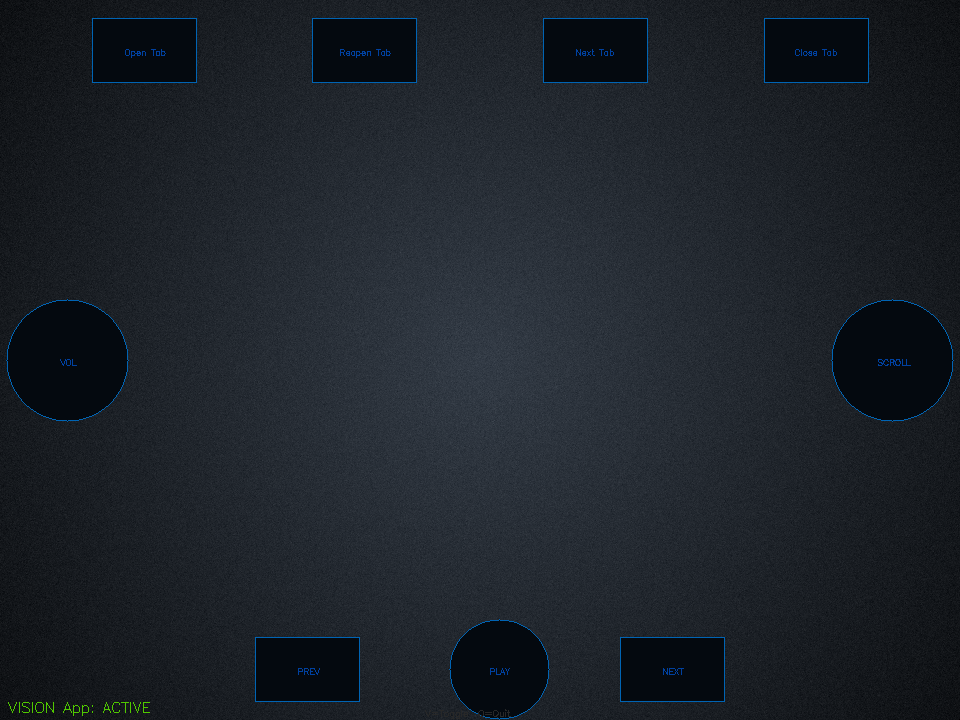
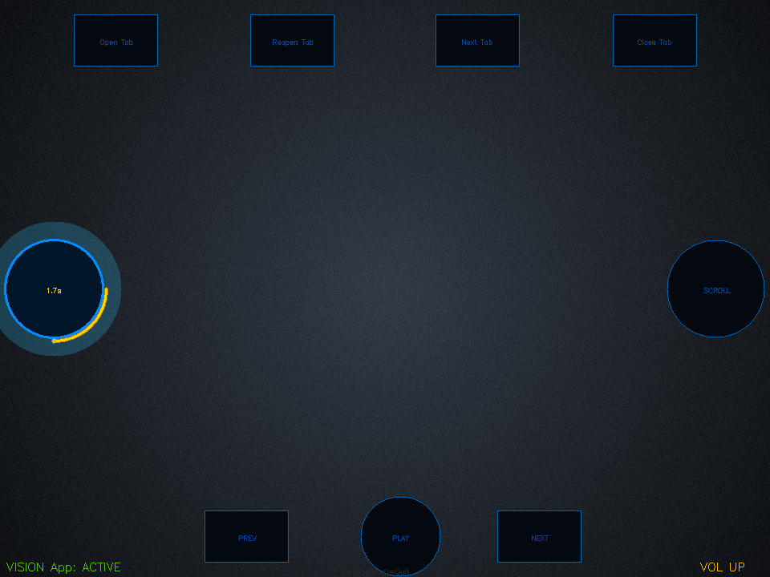
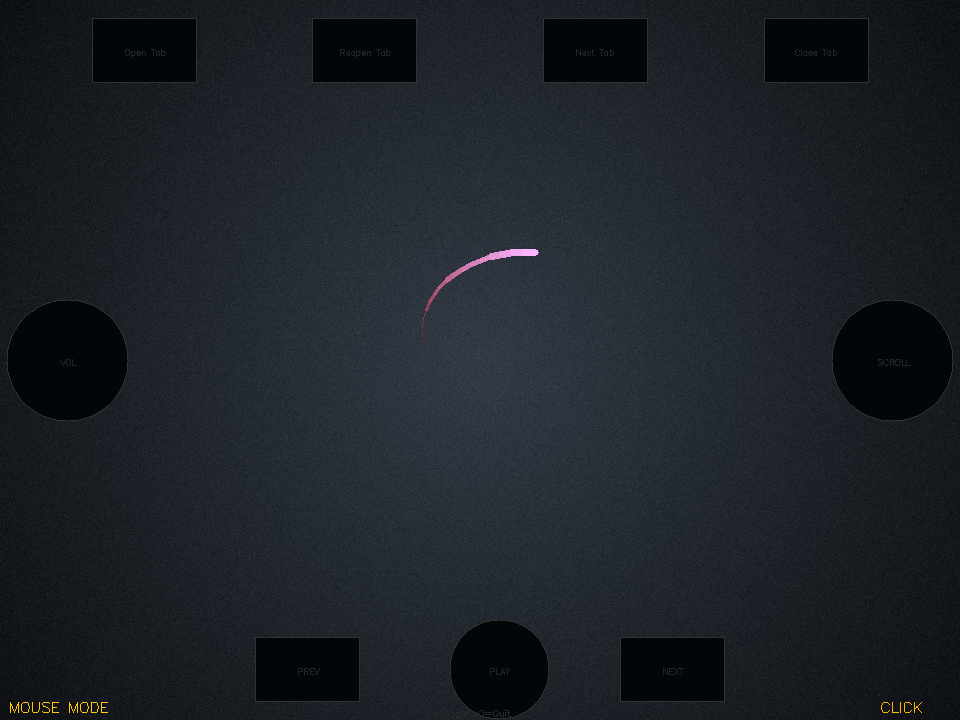
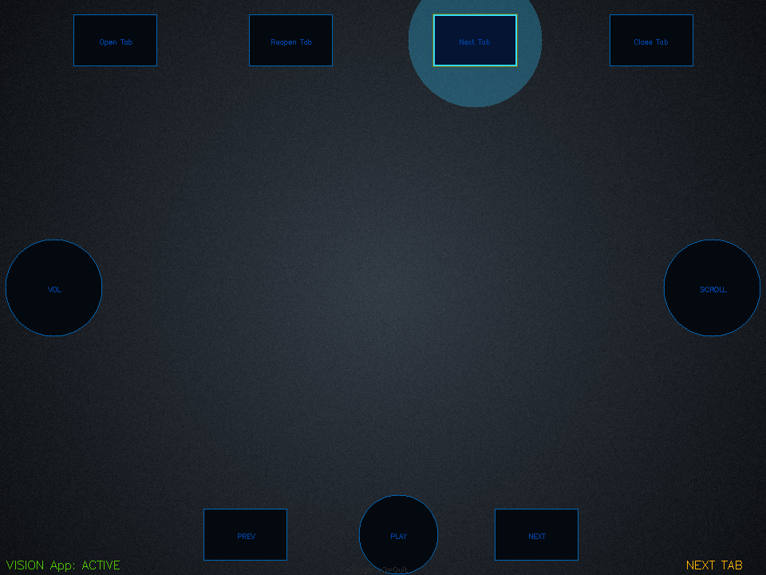
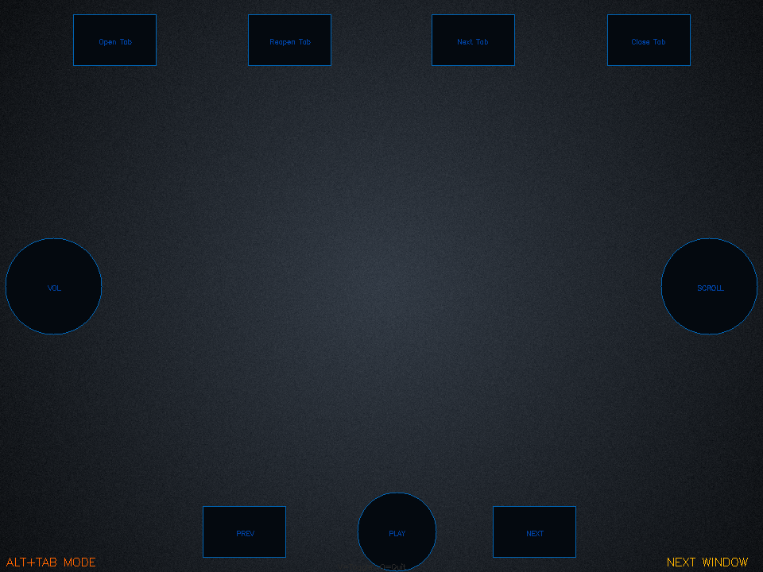

# VISION App

**Control your computer with your hands.** A gesture control system for Windows built
on MediaPipe and OpenCV — scroll, change the volume, switch windows, move the mouse and
fire your own actions, without touching a keyboard or a mouse.

Everything runs locally on the CPU. One webcam, one Python file, no cloud, no account,
no API key.

<p align="center">
  
</p>

---

## Table of contents

- [What it looks like](#what-it-looks-like)
- [Gestures](#gestures)
- [Installation](#installation)
- [Running it](#running-it)
- [How it works](#how-it-works)
- [Configuration](#configuration)
- [Project structure](#project-structure)
- [Tech stack](#tech-stack)
- [License](#license)

---

## What it looks like

The overlay sits on the camera feed: **nine zones** — four tab buttons across the top,
a volume fader on the left, a scroll fader on the right, and three media buttons along
the bottom. A zone lights up as your hand approaches it, so you can aim without looking
at your fingers.

| Locking the volume fader | Pointer mode |
|---|---|
|  |  |

**Left:** a fader has to be *locked* before it moves anything — hold your hand on it and
a countdown runs, so a hand passing through the zone never changes your volume by
accident. The rotating arc is the hold in progress.

**Right:** in pointer mode every button dims to almost nothing. You are aiming at your
screen now, not at the overlay, and a bright interface in the way is only noise.

| Reaching for a button | Alt+Tab switcher |
|---|---|
|  |  |

> Every image here is produced by `tools/render.py`, which paints the real overlay onto
> a synthetic camera frame. No webcam is opened and no cursor is moved to make them.

---

## Gestures

| Gesture | Action |
|---|---|
| ☝️ Index fingertip on a top button | Open / reopen / next / close tab |
| ✋ Hand on the left fader, then up/down | Volume — speed follows your hand |
| ✋ Hand on the right fader, then up/down | Scroll — speed follows your hand |
| 👉 Swipe right (one hand) | Next window (Alt+Tab) |
| 👈 Swipe left (one hand) | Previous window (Alt+Shift+Tab) |
| 👌 OK sign, held 1s | Open the Alt+Tab switcher (Alt stays down) |
| ✌️ Both hands still for 2s | Close the switcher (Alt released) |
| 🤚 Both hands swipe down | Custom action — blocked for 5s after any other action |
| 🖱️ Index fingertip in the centre zone | Pointer mode, with smoothing |
| 👊 Closed fist | Lock all input, with a 2.5s countdown |

---

## Installation

### Prerequisites

| | |
|---|---|
| **OS** | Windows 10 or 11. The Alt+Tab, volume and cursor control all go through Win32. |
| **Python** | 3.10–3.12. Install from [python.org](https://www.python.org/downloads/) and tick **"Add python.exe to PATH"**. |
| **Webcam** | Any. It is the only sensor. |
| **GPU** | Not needed. MediaPipe's hand model runs on the CPU in real time. |

### 1. Get the code

```powershell
git clone https://github.com/aesatyilmaz/VISION-App.git
cd VISION-App
```

### 2. Install the dependencies

```powershell
pip install -r requirements.txt
```

Or, if you prefer to keep it out of your global Python:

```powershell
python -m venv .venv
.venv\Scripts\Activate.ps1
pip install -r requirements.txt
```

That is four packages — OpenCV, MediaPipe, pyautogui and keyboard — about 300 MB,
most of it MediaPipe. Nothing is downloaded at runtime: the hand model ships inside
the MediaPipe wheel, so once this finishes the app works offline.

### 3. Run it

```powershell
python vision.py
```

Press **V** to toggle the controller on and off, **Q** to quit.

### Known install snags

| Symptom | Cause and fix |
|---|---|
| The window opens black, or "no camera" | Another app is holding the webcam — close it and try again. |
| `ImportError: DLL load failed` from OpenCV | Missing the Microsoft Visual C++ Redistributable. Install it, then reinstall `opencv-python`. |
| Gestures are detected but nothing happens | The `keyboard` library needs a low-level hook; some machines require an elevated terminal. |
| Detection is jumpy | Light your hands, not the wall behind them. MediaPipe wants contrast between hand and background more than it wants brightness. |
| Buttons are in the wrong place for your camera | Every position is normalized 0.0–1.0 — see [Configuration](#configuration). |

---

## Running it

`python vision.py` opens the camera window and starts in the **active** state.

It can also be driven from another program, which is what the helpers in
`__init__.py` are for:

```python
from vision import VisionController

v = VisionController(camera_index=0, show_window=True)
v.active = True
v.start()      # runs on its own thread
...
v.toggle()     # pause / resume gesture handling
v.stop()
```

`show_window=False` runs it headless — the gestures still fire, there is just nothing
to look at.

---

## How it works

```
Webcam feed
    ↓
MediaPipe Hands — 21 landmarks per hand, up to two hands
    ↓
Gesture classifier — swipe, tap, OK sign, fist, two-hand
    ↓
Zone detector — which button region is the hand in?
    ↓
Action executor — pyautogui / keyboard
    ↓
Overlay renderer — OpenCV: buttons, glow, trail, status
```

### Coordinate system

Every position is **normalized (0.0–1.0)** against the camera frame, so nothing depends
on the camera's resolution. Buttons are constants and can be moved without touching any
logic.

### Gesture detection

- **Swipe** — tracks palm X over the last 20 frames, fires past Δx > 0.12
- **OK sign** — thumb tip and index tip closer than a threshold, held for 1s
- **Fist (lock)** — every finger's curl value above the threshold
- **Two hands still** — both palms tracked, movement under 0.03 normalized units for 2s
- **Tap** — index fingertip inside a button's rect or circle for 2 frames

### Why the faders lock

Volume and scroll are continuous, and a hand crossing the frame passes through both
zones constantly. So they are not "hover and it moves" — you hold to lock, a countdown
runs, and only then does hand movement drive the value. The countdown is visible on the
button, and the lock releases itself.

### Why speed matters

Both faders are **velocity-based**: how far your hand moves per frame decides how much
happens, between a floor and a ceiling. A slow drag nudges, a fast flick throws. A fixed
step per frame would make long scrolls exhausting and short ones imprecise.

---

## Configuration

Everything tunable is a constant at the top of `vision.py`:

```python
COOLDOWN         = 1.2    # seconds between gesture triggers
SWIPE_THRESHOLD  = 0.12   # normalized swipe distance
SCROLL_MIN       = 50     # slowest scroll
SCROLL_MAX       = 650    # fastest scroll
VOL_MIN          = 1      # slowest volume change
VOL_MAX          = 20     # fastest volume change
MOUSE_CAM_ZONE   = 0.60   # the centre 60% of the frame maps to the whole screen
MOUSE_SMOOTHING  = 0.28   # 0 = raw, 1 = frozen
LOCK_COUNTDOWN   = 2.5    # seconds of countdown before a fader takes hold
OK_HOLD_SECS     = 1.0    # how long the OK sign opens Alt+Tab
GLOW_RADIUS      = 0.18   # how close your hand must be for a button to light up
```

Button positions, also normalized:

```python
BTN_TOP_C1_X, BTN_TOP_C1_Y = 0.15, 0.07   # top-left
BTN_TOP_C4_X, BTN_TOP_C4_Y = 0.85, 0.07   # top-right
VOL_BTN_X,    VOL_BTN_Y    = 0.07, 0.50   # left fader
SCR_BTN_X,    SCR_BTN_Y    = 0.93, 0.50   # right fader
```

After changing any of these, `python tools/render.py` redraws the overlay to
`docs/images/` so you can check the layout without opening the camera.

---

## Project structure

```
vision.py       the whole controller — gestures, zones, actions, overlay
__init__.py     start / stop / toggle helpers for embedding it elsewhere
tools/render.py paints every overlay state to PNGs, with no camera
docs/images/    those PNGs
```

One file is a deliberate choice, not an accident: the gesture classifier, the zone
detector and the renderer all read the same landmark set every frame, and splitting
them across modules would buy nothing but imports.

---

## Tech stack

| Library | Purpose | Why |
|---|---|---|
| [MediaPipe](https://mediapipe.dev) | hand landmark detection | 21 points per hand, two hands, real time, CPU only, model bundled |
| [OpenCV](https://opencv.org) | camera capture and the overlay | Both jobs in one dependency; every pixel of the interface is drawn with it |
| [pyautogui](https://pyautogui.readthedocs.io) | cursor, clicks, scrolling | The action layer |
| [keyboard](https://github.com/boppreh/keyboard) | key combinations | Alt+Tab needs Alt held across several events, which a hotkey library handles cleanly |
| `ctypes` → Win32 | virtual screen metrics | Multi-monitor support via `SM_XVIRTUALSCREEN`; standard library, not a dependency |

---

## Related

This is the standalone gesture app. A descendant of it lives inside
[TONY App](https://github.com/aesatyilmaz/TONY-App) as its vision mode — rebuilt with no
buttons at all, gesture-only, drawing into TONY's own window. The two have **diverged on
purpose** and are not kept in sync.

---

## License

[MIT](LICENSE) © Esat Yilmaz
